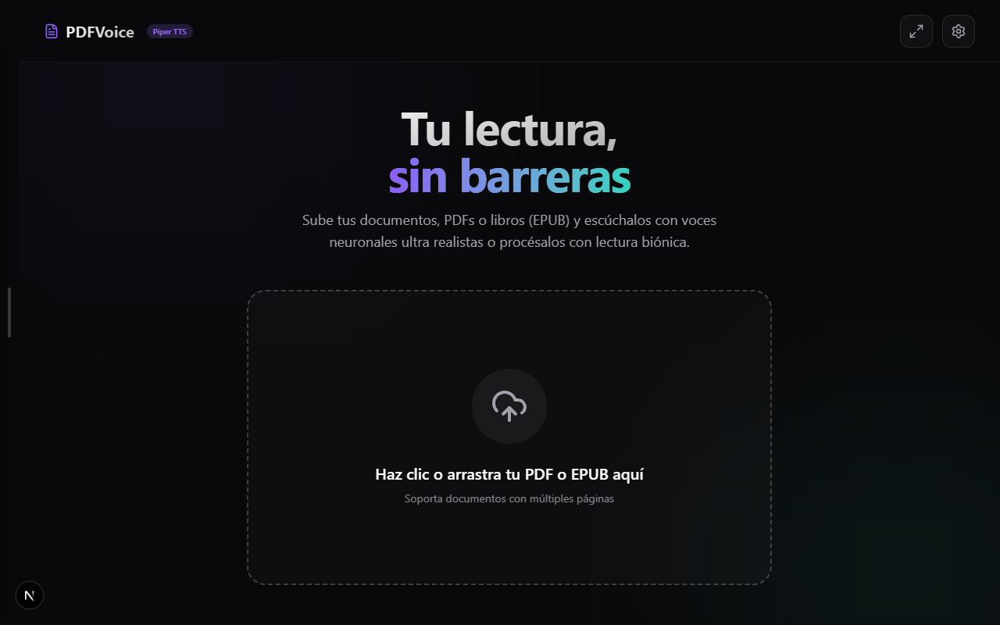

<div align="center">
  
</div>

# PDFVoice
<div align="center">
  <b>A local-first, privacy-focused, AI-powered studying tool</b> <br/>
  <b>Una herramienta de estudio local, privada y potenciada por IA</b>
</div>
<br/>

[English](#english) | [Español](#español)

---

## English

**PDFVoice** is a local-first web application designed for **AI-powered studying**. It effortlessly converts PDF and EPUB documents to speech, providing text-to-speech playback with block-level navigation. 

It comes packed with powerful **annotation tools** (highlighting, drawing, bionic reading, bookmarking) to help students and researchers consume and study documents far more efficiently. Everything is optimized to run locally ensuring maximum privacy, leveraging Microsoft Edge TTS via a local Python backend.

### Key Features
- **Smart Text-to-Speech**: Ultra-fast Time-To-First-Byte (TTFB) with auto-chunking for long text blocks.
- **Local Audio Caching**: Generated audio blocks are cached locally (via MD5 hashing) for instant offline replays and bandwidth savings.
- **Advanced Annotation Suite**: Draw, highlight text, add sticky notes, and erase right on your document.
- **Bionic Reading Mode**: Toggle bionic text rendering to speed up visual reading.
- **Beautiful UI/UX**: Dark mode by default, built with Next.js 16, React 19, and Tailwind CSS v4 featuring glassmorphic elements and buttery smooth animations.
- **Complete Privacy**: No third-party analytics. Documents are processed locally on your machine.

### Getting Started

#### 1. Setup the Backend (FastAPI)
The backend manages PDF parsing and Text-to-Speech synthesis.
```bash
cd backend
python -m venv venv
.\venv\Scripts\activate
pip install -r requirements.txt
uvicorn app.main:app --reload
```

#### 2. Setup the Frontend (Next.js)
```bash
# In the root directory
npm install
npm run dev
```

Alternatively, just run `start.bat` on Windows to launch both services simultaneously!

---

## Español

**PDFVoice** es una aplicación web de filosofía *local-first* diseñada para el **estudio asistido por Inteligencia Artificial**. Convierte documentos PDF y EPUB a voz sin esfuerzo, ofreciendo reproducción de texto a voz con navegación bloque por bloque.

Incluye potentes **herramientas de anotación** (subrayado, dibujo libre, lectura biónica, notas) para ayudar a estudiantes e investigadores a consumir y estudiar documentos de manera mucho más eficiente. Todo está optimizado para funcionar localmente garantizando la máxima privacidad, aprovechando Microsoft Edge TTS a través de un backend local en Python.

### Características Principales
- **Texto a Voz Inteligente**: Tiempo de respuesta ultrarrápido (TTFB) con fragmentación automática para bloques de texto largos.
- **Caché de Audio Local**: Los bloques de audio generados se guardan en caché local (mediante hash MD5) para repeticiones instantáneas sin conexión, ahorrando ancho de banda.
- **Suite de Anotación Avanzada**: Dibuja, subraya texto, añade notas adhesivas y borra directamente sobre tu documento.
- **Modo de Lectura Biónica**: Activa la lectura biónica para acelerar la velocidad de lectura visual.
- **Interfaz Increíble (UI/UX)**: Modo oscuro por defecto, construido con Next.js 16, React 19 y Tailwind CSS v4, con elementos *glassmorphism* y animaciones súper fluidas.
- **Privacidad Total**: Sin analíticas de terceros. Los documentos se procesan localmente en tu ordenador.

### Cómo Empezar

#### 1. Configurar el Backend (FastAPI)
El backend se encarga de procesar el PDF y la síntesis de Texto a Voz.
```bash
cd backend
python -m venv venv
.\venv\Scripts\activate
pip install -r requirements.txt
uvicorn app.main:app --reload
```

#### 2. Configurar el Frontend (Next.js)
```bash
# En el directorio raíz
npm install
npm run dev
```

¡Alternativamente, simplemente ejecuta `start.bat` en Windows para iniciar ambos servicios a la vez!
